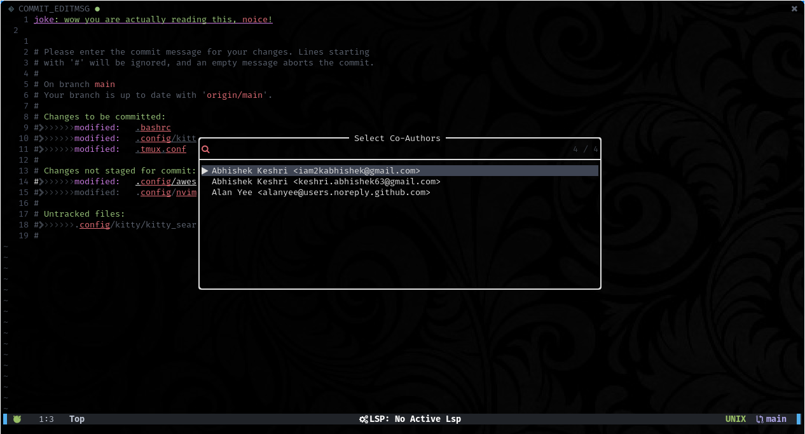

<div align = "center">

<h1><a href="https://2kabhishek.github.io/co-author.nvim">co-author.nvim</a></h1>

<a href="https://github.com/2KAbhishek/co-author.nvim/blob/main/LICENSE">
 </a>

<a href="https://github.com/2KAbhishek/co-author.nvim/graphs/contributors">
 </a>

<a href="https://github.com/2KAbhishek/co-author.nvim/stargazers">
</a>

<a href="https://github.com/2KAbhishek/co-author.nvim/network/members">
 </a>

<a href="https://github.com/2KAbhishek/co-author.nvim/watchers">
 </a>

<a href="https://github.com/2KAbhishek/co-author.nvim/pulse">
 </a>

<h3>Add commit authors from nvim 💻🪄</h3>

<figure>
  
  <br/>
  <figcaption>co-author.nvim screenshot</figcaption>
</figure>

</div>

## What is this

How many times have you been working on a piece of code with someone and then when committing you ask their full name and email address for adding a Co-author to the commit?

Upgrade to 21st century, use this plugin to automatically fetch author details from your commit history and then add to your commit message.

It shows you a list of all the unique authors in your current repo.

`co-author.nvim` automatically works with telescope and presents the list in a nice fuzzy searchable UI.

## Inspiration

Noticed something similar on a co-workers using IntelliJ, and I wanted it!

## Prerequisites

Before you begin, ensure you have met the following requirements:

- You have installed the latest version of `neovim`
- [dressing.nvim](https://github.com/stevearc/dressing.nvim) — for prettier select UI
- [telescope](https://github.com/nvim-telescope/telescope.nvim) — for fuzzy searching in list

## Installing co-author.nvim

To get co-author.nvim, add the following to your plugin list:

```lua
-- Packer
use '2kabhishek/co-author.nvim'

-- Lazy
'2kabhishek/co-author.nvim'

```

## Using co-author.nvim

`co-author.nvim` adds a new command `:GitCoAuthors`.

You can add your custom bindings for the command `:GitCoAuthors`, the recommended keybinding is `<leader>gA`.

check `:help co-author` for more details.

> NOTE: By default there are no configured keybindings.

## How it was built

co-author.nvim was built using `nvim, lua`

## Challenges faced

Figuring out vim's rtp was tricky initially.

## What I learned

- Learned about nvim plugin ecosystem
- Explored vim APIs

## What's next

You tell me!

Hit the ⭐ button if you found this useful.

## More Info

<div align="center">

<a href="https://github.com/2KAbhishek/co-author.nvim">Source</a> | <a href="https://2kabhishek.github.io/co-author.nvim">Website</a>

</div>
