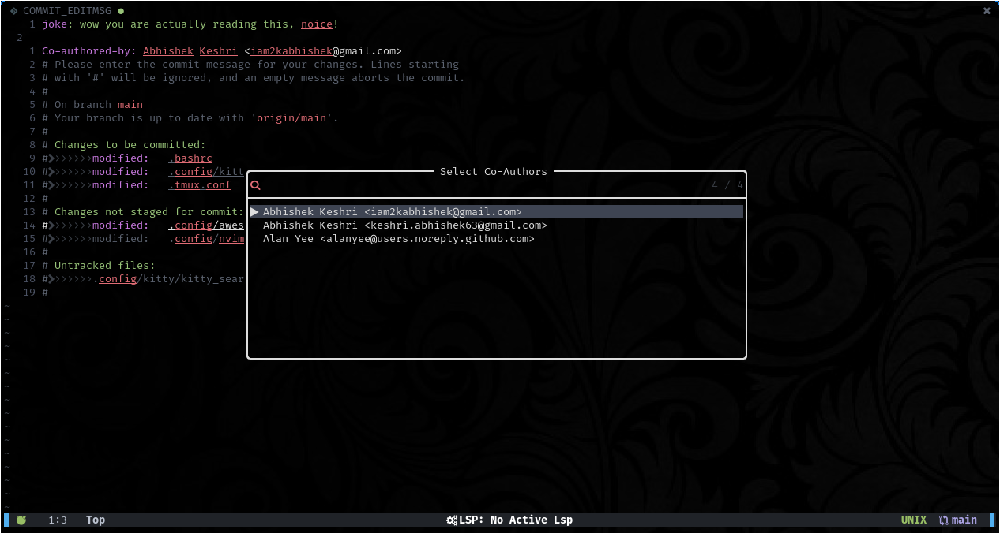

<div align = "center">

<h1><a href="https://2kabhishek.github.io/co-author.nvim">co-author.nvim</a></h1>

<a href="https://github.com/2KAbhishek/co-author.nvim/blob/main/LICENSE">
 </a>

<a href="https://github.com/2KAbhishek/co-author.nvim/graphs/contributors">
 </a>

<a href="https://github.com/2KAbhishek/co-author.nvim/stargazers">
</a>

<a href="https://github.com/2KAbhishek/co-author.nvim/network/members">
 </a>

<a href="https://github.com/2KAbhishek/co-author.nvim/watchers">
 </a>

<a href="https://github.com/2KAbhishek/co-author.nvim/pulse">
 </a>

<h3>Quickly add co-authors to commits 💻🪄</h3>

<figure>
  
  <br/>
  <figcaption>co-author.nvim screenshot</figcaption>
</figure>

</div>

## What is this

How many times have you been pairing on a feature and then when committing you had to manually paste their details for adding a Co-author to the commit?

This plugin automatically fetches author details from the repo's commit history and then adds it to your commit message.

It shows you a list of all the unique authors in your current repo on a nice fuzzy searchable list.

`co-author.nvim` automatically works with configured pickers and presents the list in a fuzzy searchable UI.

Here's a [demo video](https://youtu.be/mBLLyOLwSf4?si=2Bdw900ROLp63LEg) for a quick walk-through.

## Inspiration

Noticed something similar on a co-workers using IntelliJ, and I wanted it!

## Prerequisites

Before you begin, ensure you have met the following requirements:

- You have installed the latest version of `neovim`
- [snacks.nvim picker](https://github.com/folke/snacks.nvim/blob/main/docs/picker.md) — for prettier select UI and multi select (optional, recommended)

## Installing co-author.nvim

To get co-author.nvim, add the following to your plugin list:

```lua
-- Lazy
{
    '2kabhishek/co-author.nvim',
    dependencies = {
        'folke/snacks.nvim',
    },
    cmd = {'CoAuthor'},
},

-- Packer
use '2kabhishek/co-author.nvim'

```

## Using co-author.nvim

`co-author.nvim` adds a `:CoAuthor` command that will show you the list of unique co authors who have already contributed to the current git repo.

**Multi-select Support**: When using with [snacks.nvim picker](https://github.com/folke/snacks.nvim/blob/main/docs/picker.md), you can select multiple co-authors at once:

- Use `<Tab>` to select/deselect individual authors
- Use `<Ctrl-a>` to select all authors on a filtered list
- Use `<Enter>` to confirm your selection

If snacks.nvim is not available, it will fallback to the built-in `vim.ui.select` for single selection.

You can add your custom bindings for the command `:CoAuthor`, the recommended keybinding is `<leader>gC`.

check `:help co-author` for more details.

> NOTE: By default there are no configured keybindings.

## How it was built

co-author.nvim was built using `neovim, lua`

## Challenges faced

Figuring out vim's rtp was tricky initially.

## What I learned

- Learned about nvim plugin ecosystem
- Explored vim APIs

## What's next

You tell me!

Hit the ⭐ button if you found this useful.

## More Info

<div align="center">

<a href="https://github.com/2KAbhishek/co-author.nvim">Source</a> | <a href="https://2kabhishek.github.io/co-author.nvim">Website</a>

</div>
